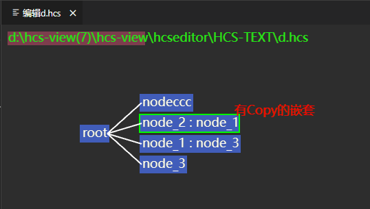
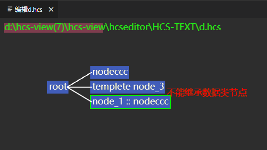

# HCS可视化工具 

## 工具约束说明

### 1. 复制类节点不支持嵌套

问题描述：当复制类型节点A复制复制类型节点B（节点B已复制数据类型节点C），节点A报错，提示“有Copy的嵌套”。如下图所示：

### 2. 引用类节点不支持嵌套

问题描述：当引用类型节点A引用引用类型节点B（节点B已引用数据类型节点C），节点A报错，提示“循环引用”。如下图所示：

### 3. 模板与继承的双重绑定

问题1描述：数据类继承节点只能继承模板类节点，继承其他类节点报错，提示“不能继承XX类节点”，如下图所示：

问题2描述：模板类节点只能被数据类继承节点继承，被复制类节点复制或者引用类节点引用时报错，提示“复制目标不能为模板节点”，如下图所示：

