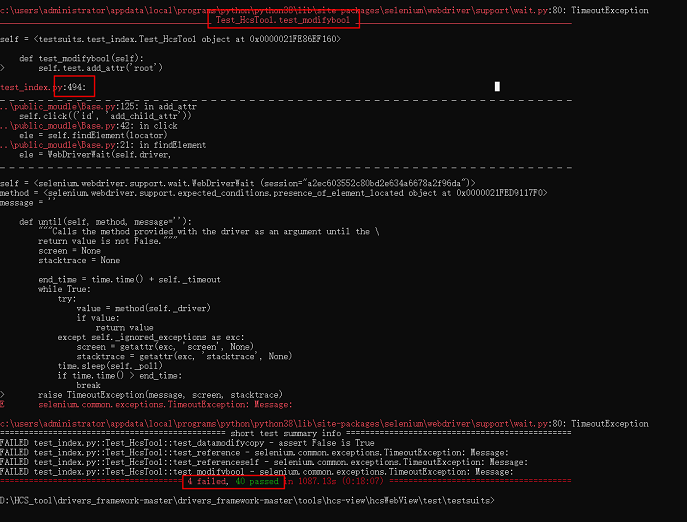

# HCS可视化工具单元测试

## 概述
为了验证代码与设计相符合，跟踪需求和设计的实现，发现设计和需求中存在的错误。需要用单元测试检验被测代码的一个很小的、明确的功能是否正确。
本文主要介绍HCS可视化工具单元测试使用指导。

## 目录

    drivers_framework  
	└── tools
			└── hcs-view   
				    ├── ...                     # 其他文件             
				    └── hcsWebView              # hcs可视化处理WebView源码，用于界面的绘制呈现等处理
					    ├── ...                 # 其他文件
					    └── test                # 工具单元测试用例
						    ├── figures         # 图片文件
						    ├── public_moudle   # selenium二次封装文件
						    ├── testsuits       # 工具单元测试用例文件
						    ├── conftest.py     # selenium框架全局变量
						    └── README.md       # 指导文档  
	 
## 软件环境准备

依赖版本：python3.8

1.右键windows开始菜单，单击运行，输入cmd，单击确定。

2.在命令行中进入到hcsWebView\test目录下，安装selenium，此处默认安装版本为3.141.0，命令如下：

		pip install selenium==3.141.0

3.查看谷歌浏览器版本，此处得到浏览器版本为101.0.4951.67，查询网址如下：

[查看浏览器版本](chrome://version/)

4.由于浏览器版本为101.0.4951.67，查看驱动版本列表中是否有101.0.4951.67版本，若有可下载此版本驱动；若没有可下载101.0.4951最小版本，此处选择101.0.4951.15版本。进入版本系统选择列表后，选择win32（win系统不区分win32或win64）下载压缩包，下载地址如下：

[驱动下载地址](http://npm.taobao.org/mirrors/chromedriver/)

5.将解压缩获得的驱动文件放入python根目录下：

## 安装依赖

1. 安装pytest。

		pip install pytest

2. 安装EasyOCR，用于识别图像中的文字，并输出中文。

		pip install easyocr

3. 安装allure报告。

		pip install allure-pytest

## 使用说明

进入test/testsuits/目录：

1. 执行所有用例，命令为：

		pytest -s -W ignore test_index.py

2. 执行单个用例,如test_rootselfattr，命令为：

		pytest -s -W ignore test_index.py::Test_HcsTool::test_rootselfattr

## 查看结果

用例执行结果如下图所示：

failed：用例执行失败，代表修改的代码有bug或者用例的输出发生变化，需要修复bug或修改用例。

passed：用例执行成功。

备注：此处一共44条用例，其中4条用例结果为失败，40条用例结果为成功，如图所示命令行中会显示具体哪条用例失败，可单独重跑失败用例，查看是否是用例输出有变化还是代码有bug。此处以上图失败用例为例，重跑用例，结果成功，说明代码无问题。重跑用例结果如下：

## 相关仓

暂无
