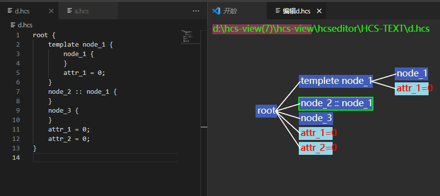

# HCS可视化工具

## 简介

本文主要介绍HCS可视化工具，它可以根据用户给出的HCS文件实现可视化配置与HCS文件内容双向绑定、同步更新展示的效果。目前工具支持VS Code插件入口。

更多工具的架构和实现原理详情，可以左键单击以下链接了解：

[工具使用说明](https://gitee.com/openharmony/drivers_framework/tree/master/tools/hcs-view/docs/INSTRUCTION_zh.md)

## 目录
    drivers_framework  
	└── tools                         
			└── hcs-view 
		 			├── docs             # 工具说明文档
		 			├── examples         # 工具需要的文件样例
		 			├── figures          # 图片文件               
		 			├── hcsVSCode        # VSCode工程代码，用于hcs文件与hcsWebView之间传递数据
		 			├── hcsWebView       # hcs可视化处理WebView源码，用于界面的绘制呈现等处理
		      		│	├── src          # hcs源码 
		     		│	└── test         # 工具单元测试用例
		 			├── prebuilt         # 插件存放地址  
		 			├── FAQ.md           # 工具约束说明  
		 			├── OWNER            # 所有者说明
		 			└── README_zh.md     # 工具使用指导文档 

## 约束

依赖版本：VS Code 1.62.0版本及以上版本

## 使用方法

### 使用对象

HDF驱动开发者

### 使用场景

1) 需对HCS文件预览，窗口中展示可视化配置对应的HCS文件内容。

2) 需对HCS文件编辑，窗口中进行HCS文件编辑，保存后，在可视化配置页面同步更新呈现。

### 工具使用

工具为VS Code插件，存放路径在申请中，后续更新。

具体的工具使用步骤，可以左键单击以下链接了解：

[工具使用说明](https://gitee.com/openharmony/drivers_framework/tree/master/tools/hcs-view/docs/INSTRUCTION_zh.md)

### 工具输出

 1. 根据使用者指定的hcs配置文件，工具会输出hcs文件内容对应的可视化配置图,可供测试的hcs文件存放在以下路径：

	```
	drivers_framework/tools/hcs-view/examples
	```
   
	在window环境下，根据输入文件生成可视化窗口，如下图所示：
   

 2. 根据用户可视化配置，工具会生成hcs配置文件, 如下图所示：
 


## 工具开发说明

### 对象

工具的开发者

### 开发场景

若当前工具的功能已经不能满足开发者的全部需求，则开发者可以基于已有的源码对工具进行二次开发，来增强工具的能力，编译打包生成自定义的插件。

### 开发步骤

[工具开发说明](https://gitee.com/openharmony/drivers_framework/tree/master/tools/hcs-view/doc/DEVELOP_zh.md)

## 版本说明

 暂无

## FAQ

对于常见问题解决方法指导如下：

[FAQ](https://gitee.com/openharmony/drivers_framework/tree/master/tools/hcs-view/FAQ.md)

## 参与贡献

暂无

## 相关仓

暂无
