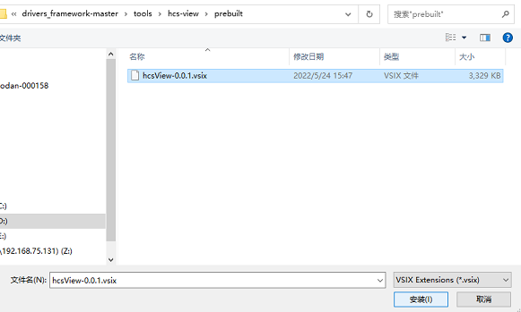
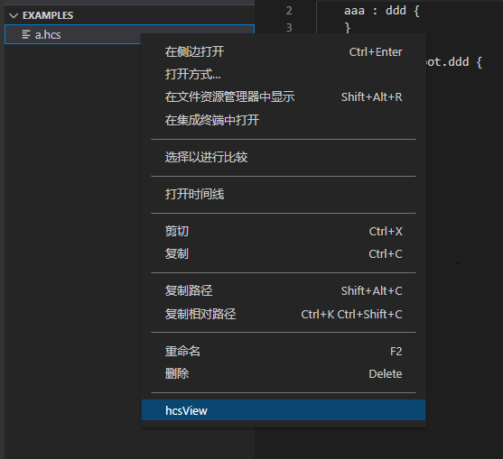

# HCS可视化工具使用说明

## 简介

HCS可视化工具支持HCS文件预览与编辑，具有可视化配置与HCS文件内容双向绑定、同步更新展示的优点。VS Code插件存放在以下路径：

```
drivers_framework/tools/hcs-view/prebuilt
```              

## 工具介绍

通过HCS可视化工具，使用者可在hcs-view\examples目录下新增或添加已有的hcs文件，通过编辑hcs文件打开配置节点UI图，进行预览、编辑等操作。HCS可视化工具的软件架构如下：

   

## VS Code插件使用方法

### 说明
visual studio code 版本需1.62.0及以上。

### 步骤

1.打开VS Code，在左侧边栏中选择插件安装。

   

2.单击上面三个点的按钮，选择从VSIX安装选项，然后选择生成的hcsView-0.0.1.vsix插件文件，再单击安装。

   

   

3.安装完成后就会在VS Code的插件管理器中能看到hcsView这个插件了。

   

4.在VS Code中drivers_framework/tools/hcs-view/examples路径下找到需要编辑的hcs文件，鼠标单击右键选择“hcsView”，例如：

   

5.以上步骤操作成功后，即可打开可视化节点配置窗口，例如：

   


## 注意
暂无
